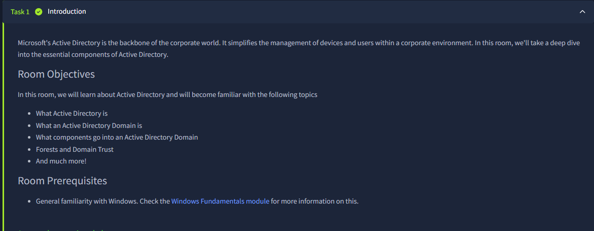
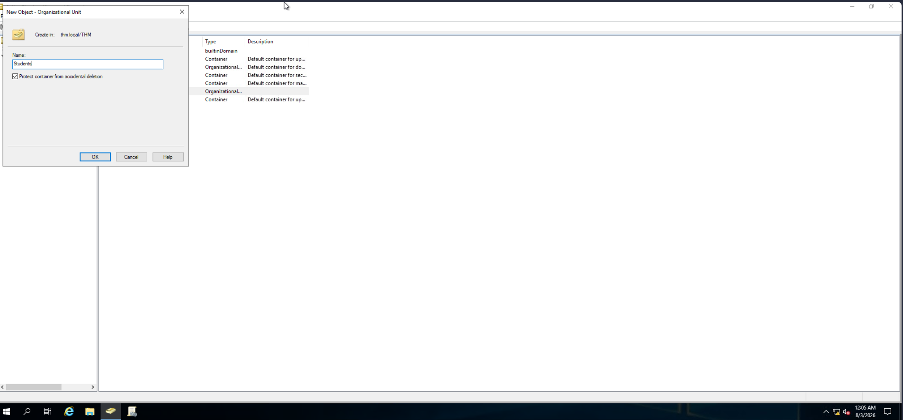
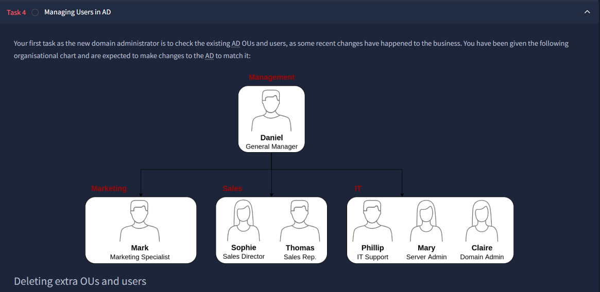
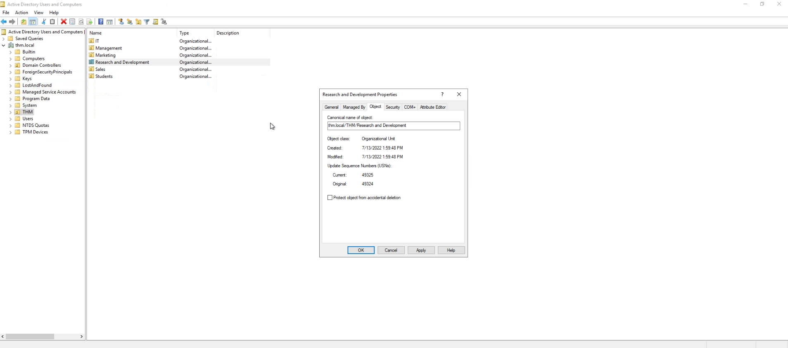
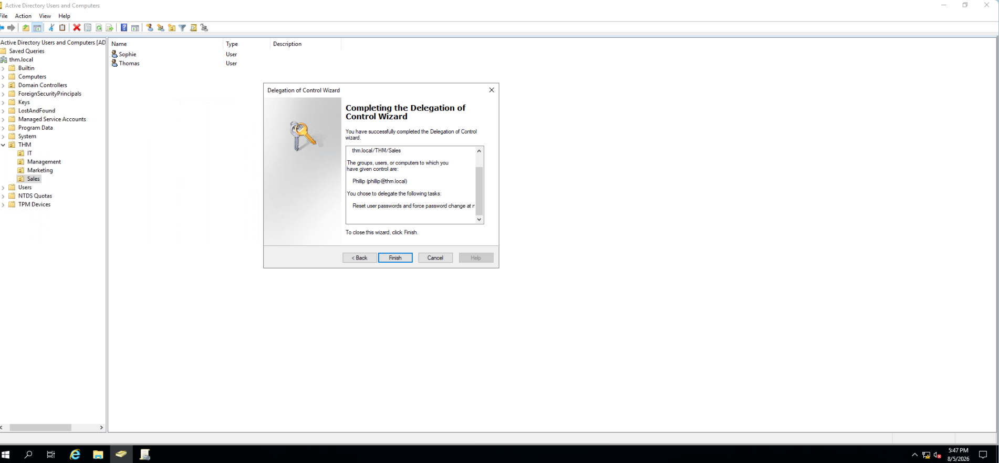
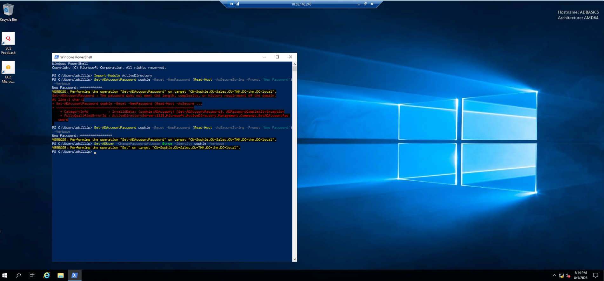
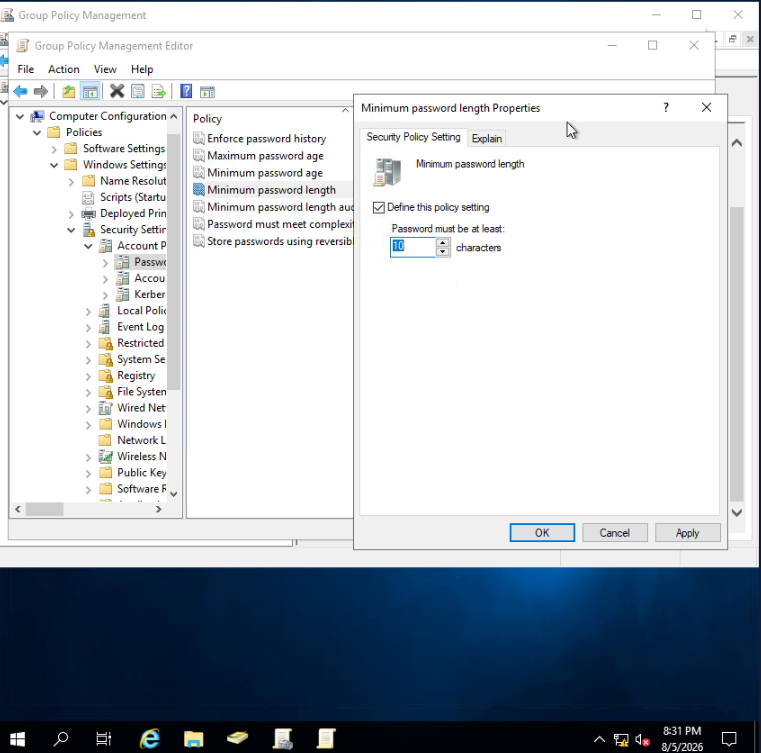
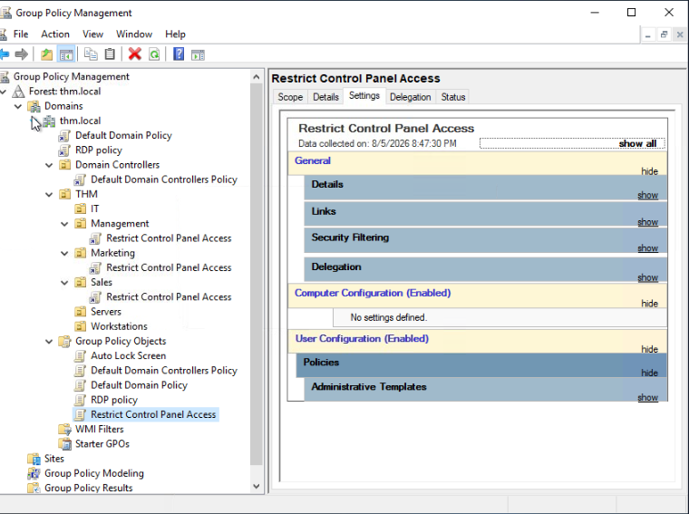
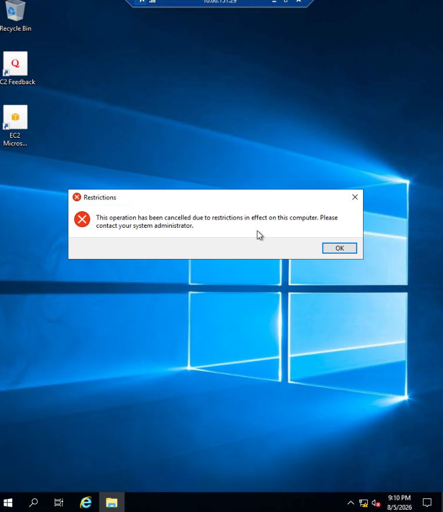

# Active Directory Administration Home Lab

**Author:** Jerrell Hawkins

**Skills:** Windows Server, AD DS, ADUC, Group Policy, PowerShell, RDP

## Project documentation

[View slide deck as PDF](active-directory.pdf) | [Download PowerPoint](active-directory.pptx)

The notes and images below are drawn from the supplied project presentation. Lab accounts, networks, and incidents are practice scenarios.

## Slide 1

IT PORTFOLIO PROJECT

Active Directory
Administration Home Lab

Guided TryHackMe virtual environment

Jerrell Hawkins

Windows Server | AD DS | Group Policy | PowerShell | RDP

Lab objective

Practice Active Directory domains, OU’s and user administration, delegated access, Group Policy, and remote validation.

## Slide 2

PROJECT OVERVIEW

The Lab Simulated Core Tier 1 Domain Administration Work

02

Environment

Windows Server domain inside a guided TryHackMe virtual machine; administration performed through Microsoft management consoles, RDP, and PowerShell.

Directory operations

Created an OU, aligned users to department OUs, and removed an obsolete OU after intentionally disabling deletion protection.

Access control

Delegated only the Sales password-reset task to Phillip instead of granting broad administrative membership.

Policy and validation

Configured password and workstation controls, linked GPOs at the correct scope, and tested the result from a standard user's session.

## Slide 3

OU DESIGN AND USER MANAGEMENT

I Rebuilt the Directory Structure to Match the Business Model

03

Created the Students OU

In Active Directory Users and Computers (ADUC), I right-clicked the domain container, selected New > Organizational Unit, entered Students, and kept accidental-deletion protection enabled.

Aligned objects to the target state

I used the organizational chart as the desired state, reviewed existing OUs and user accounts, and reorganized or removed objects so Management, Marketing, Sales, and IT matched their assigned roles.

## Slide 4

OU LIFECYCLE MANAGEMENT

I Removed an Obsolete OU only after Disabling its Safety Control

04

Resolution

- Enabled View > Advanced Features in ADUC.
- Opened the R&D OU's Properties and selected the Object tab.
- Cleared Protect object from accidental deletion.
- Deleted the obsolete OU because it was not part of the approved target structure.

Technical correction

This action removed a deletion-protection flag. It did not grant the administrator new privileges.

## Slide 5

LEAST-PRIVILEGE DELEGATION

I Delegated Password Resets without Granting Broad Admin Rights

05

Delegation path

- Right-clicked the Sales OU and opened Delegate Control.
- Added THM\phillip and confirmed the account name.
- Selected Reset user passwords and force password change at next login.
- Completed the wizard and scoped the permission to the Sales OU.

Why it matters

Phillip received one support capability for one department - a practical example of least privilege.

## Slide 6

RDP AND POWERSHELL ACCOUNT SUPPORT

I Corrected a Failed Delegated Password Reset

06

Commands used

Set-ADAccountPassword sophie -Reset -NewPassword
(Read-Host -AsSecureString -Prompt 'New Password') –Verbose

Set-ADUser -Identity sophie -ChangePasswordAtLogon $true -Verbose

What the evidence shows

- Connected over RDP as THM\phillip and imported the ActiveDirectory module.
- The first password was rejected because it did not meet domain policy.
- Retried with another password; the reset succeeded.
- Used a separate Set-ADUser command to require a password change at Sophie's next logon.

Support skill demonstrated

Read the error, corrected the input, retried safely, and verified verbose success output.

## Slide 7

DOMAIN PASSWORD POLICY

I Strengthened the Domain Password Baseline to 10 Characters

07

Configuration

- Opened Group Policy Management and edited the Default Domain Policy.
- Navigated to Computer Configuration > Policies > Windows Settings > Security Settings > Account Policies > Password Policy.
- Changed Minimum password length from 7 to 10 characters.
- Used the Explain tab to review the policy's behavior and requirements.

Scope awareness

Domain password policy is configured at the domain level, so this setting establishes the minimum for domain accounts.

## Slide 8

GROUP POLICY CONFIGURATION

I Linked Workstation Controls at the Scope where They were Needed

08

Restrict Control Panel Access

- Created a dedicated GPO and enabled Prohibit access to Control Panel and PC settings under User Configuration.
- Linked the GPO to the Management, Marketing, and Sales OUs.

Auto Lock Screen

- Created a second GPO with a five-minute machine inactivity limit.
- Linked it at the root domain so the workstation-lock setting could apply domain-wide.

Technical wording: dragging a GPO to an OU creates a link; it does not merge the GPO with the OU.

## Slide 9

VALIDATION AND EVIDENCE

RDP Testing Confirmed the Control Panel Restriction

09

Test method

- Connected to the Windows host with Remote Desktop as Mark, a user in the Marketing OU.
- Attempted to open Control Panel from the user session.
- Observed the system message that the operation was canceled because of restrictions.
- Confirmed the user-scoped GPO was applied to the intended department.

Result

The control moved from configuration to verified behavior - the key difference between making a change and proving it worked.

## Slide 10

WORKFLOW SUMMARY

The Project Followed an End-to-End Administration Workflow

10

01  ORGANIZE

Build the directory

Created and aligned OUs and user accounts to the approved department structure.

02  CONTROL

Apply least privilege

Delegated password support and configured domain and workstation policies at the correct scope.

03  VERIFY

Test the outcome

Used PowerShell verbose output and an RDP user session to confirm the intended behavior.

## Slide 11

SKILLS DEVELOPED

What I learned from the Lab

11

Directory design

How OUs provide an administrative and Group Policy boundary for organizing users by business role.

Least privilege

How the Delegation of Control Wizard can grant a narrowly scoped task without unnecessary administrative access.

PowerShell support

How to reset an AD account securely, interpret policy errors, and require a password change at next sign-in.

Policy lifecycle

How to configure, link, scope, and validate GPOs instead of assuming a saved setting is working.

## Slide 12

End

Summary

12

Active Directory Administration Lab | TryHackMe VM

- Built and administered a Windows Server Active Directory lab, organizing users into role-based OUs and removing obsolete directory objects.
- Delegated password-reset permissions at the Sales OU level and used PowerShell over RDP to reset an account and require a password change at next sign-in.
- Configured and linked GPOs for a 10-character minimum password length, department-level Control Panel restrictions, and automatic workstation lock after five minutes; validated policy enforcement through user testing.

Skills: Active Directory Domain Services, ADUC, Group Policy Management, PowerShell, RDP, OU administration, delegated permissions, troubleshooting

