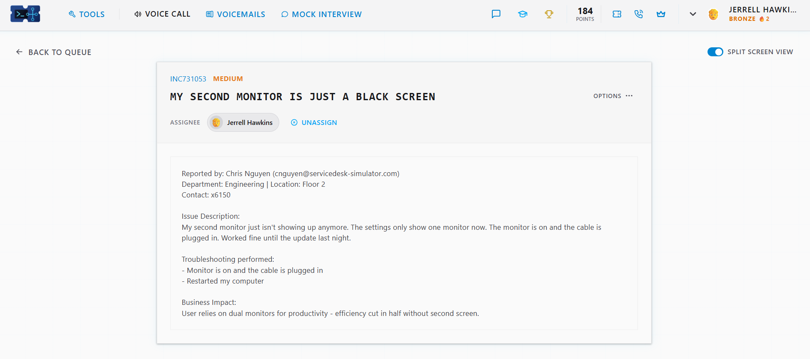
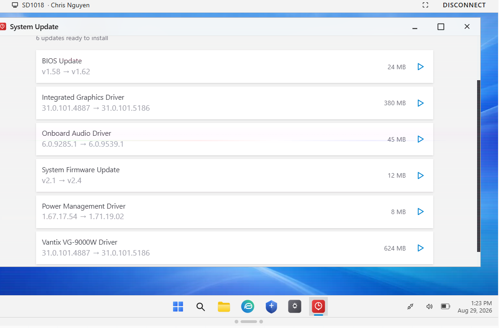
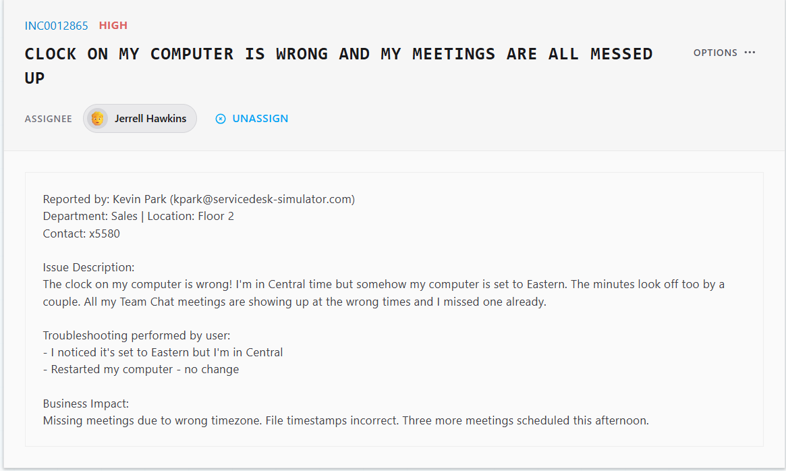
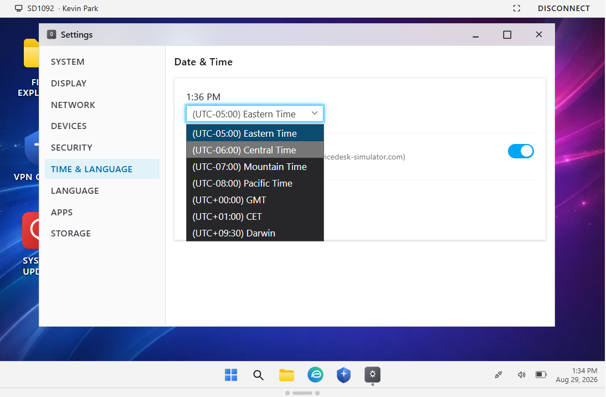
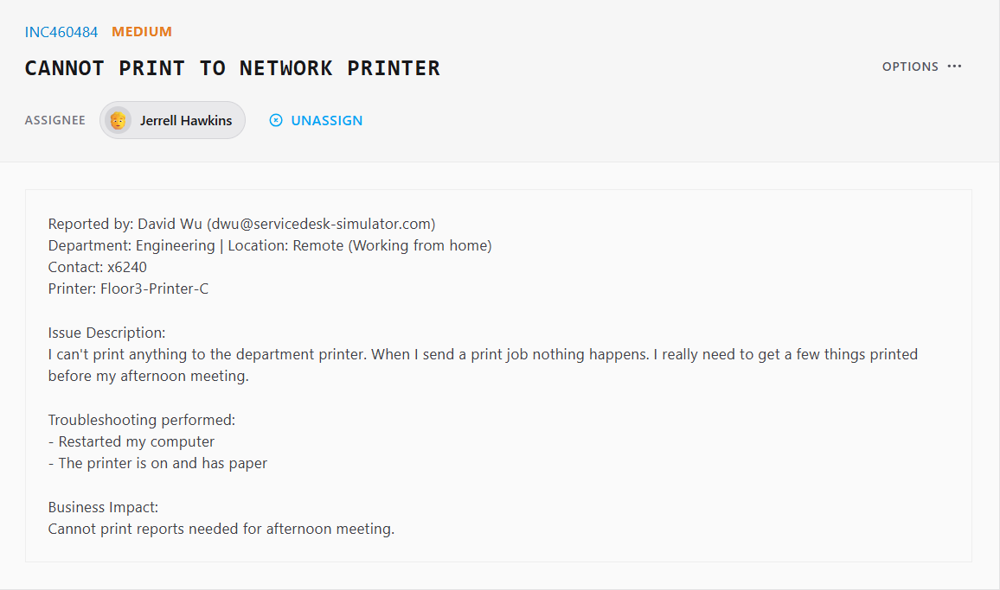
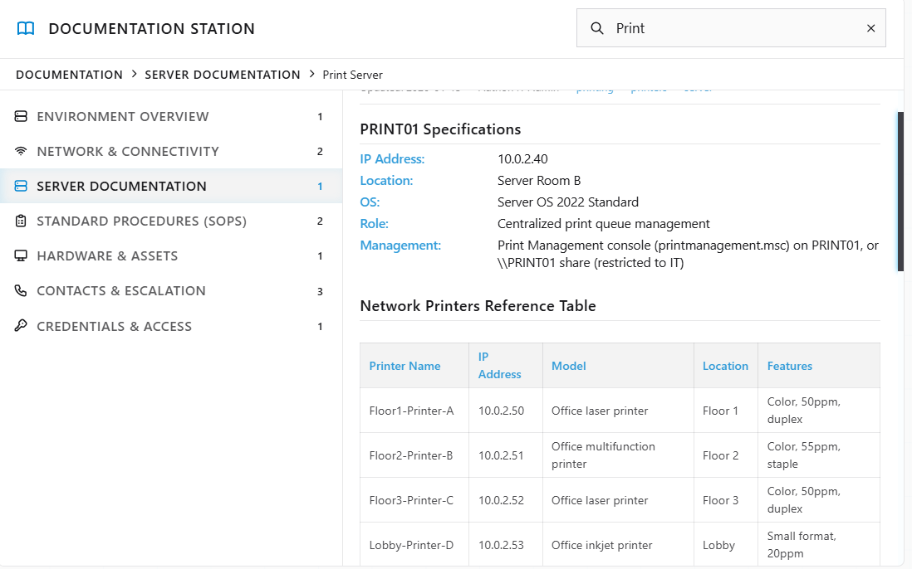
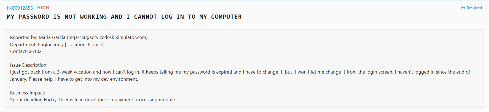
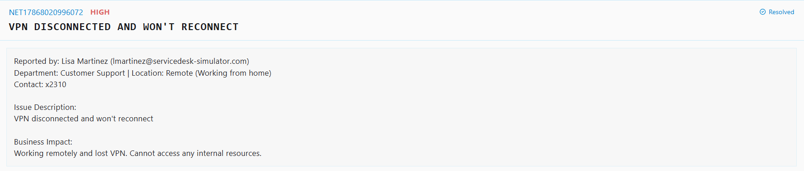
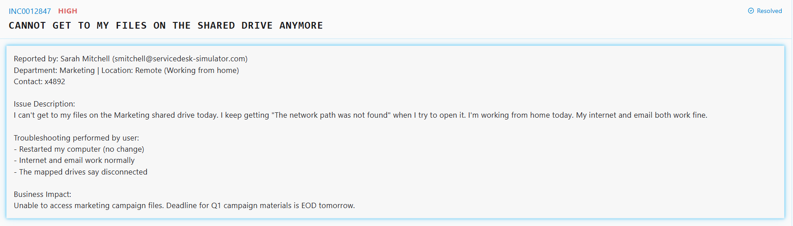

# ServiceDesk Simulator Help Desk Lab

**Author:** Jerrell Hawkins

**Skills:** Remote support, Windows settings, network printing, password resets, VPN, shared drives

## Project documentation

[View slide deck as PDF](servicedesk.pdf) | [Download PowerPoint](servicedesk.pptx)

The notes and images below are drawn from the supplied project presentation. Lab accounts, networks, and incidents are practice scenarios.

## Slide 1

JERRELL HAWKINS  |  IT SUPPORT PORTFOLIO

ServiceDesk Simulator
Help Desk Projects

Six hands-on incidents resolved through remote support, documentation, secure access workflows, and clear ticket closure.

DISPLAY  |  TIME SETTINGS  |  NETWORK PRINTING  |  PASSWORD RESET  |  VPN  |  SHARED DRIVES

## Slide 2

A driver update restored the second monitor

ISSUE

After an overnight update, the user's second monitor remained black and Windows detected only one display.

ACTIONS

• Connected to the workstation through remote support.
• Installed BIOS, graphics, firmware, power-management, and device-driver updates.
• Restarted the PC and documented the resolution.

OUTCOME

The second display returned and the ticket was closed.

RDP  |  BIOS & DRIVERS  |  RESTART VALIDATION  |  TICKET NOTES

JERRELL HAWKINS  |  IT SUPPORT PORTFOLIO

02

## Slide 3

Correct time zone restored meeting accuracy

ISSUE

A remote sales user's PC was set to Eastern Time instead of Central, causing missed meetings and incorrect timestamps.

ACTIONS

• Connected remotely and opened Date & Time settings.
• Changed the workstation from Eastern to Central Time.
• Verified the corrected clock and documented closure.

OUTCOME

Meeting times and file timestamps displayed correctly again.

REMOTE SUPPORT  |  WINDOWS SETTINGS  |  USER IMPACT  |  VERIFICATION

JERRELL HAWKINS  |  IT SUPPORT PORTFOLIO

03

## Slide 4

Documented IP restored network printing

ISSUE

A remote engineering user could not print because the network printer was configured with the wrong IP address.

ACTIONS

• Checked the knowledge base for Floor3-Printer-C.
• Confirmed the correct address: 10.0.2.52.
• Replaced the incorrect configuration and ran a test print.

OUTCOME

The test page printed successfully and access was restored.

KNOWLEDGE BASE  |  TCP/IP PRINTING  |  REMOTE SUPPORT  |  TESTING

JERRELL HAWKINS  |  IT SUPPORT PORTFOLIO

04

## Slide 5

Secure reset restored access at first login

SECURE WORKFLOW

Verify identity
Reset temporary credential
Require change at first login

ISSUE

An expired password prevented a lead developer from signing in to a time-sensitive development environment.

ACTIONS

• Located the account in directory tools and sent a one-time verification code.
• Reset the expired password after identity verification.
• Shared the temporary credential through Team Chat and required a change at first login.

OUTCOME

The user regained access through a verified and secure handoff.

IDENTITY VERIFICATION  |  DIRECTORY TOOLS  |  PASSWORD RESET  |  SECURE HANDOFF

JERRELL HAWKINS  |  IT SUPPORT PORTFOLIO

05

## Slide 6

DNS flush and reboot restored the VPN tunnel

KEY COMMAND

ipconfig /flushdns

Reboot  |  reconnect  |  verify

ISSUE

A remote employee lost VPN access and could no longer reach internal resources.

ACTIONS

• Connected through remote support and opened Terminal.
• Ran ipconfig /flushdns, restarted the workstation, and re-established the authenticated session.
• Reconnected the VPN client and verified the tunnel returned online.

OUTCOME

Secure access to internal resources was restored.

DNS CACHE  |  TERMINAL  |  VPN TROUBLESHOOTING  |  POST-REBOOT VALIDATION

JERRELL HAWKINS  |  IT SUPPORT PORTFOLIO

06

## Slide 7

VPN and UNC mapping restored shared-drive access

RESTORED PATH

VPN connected
Marketing UNC path mapped to D:
Files opened successfully

ISSUE

A remote Marketing user received 'network path not found' while email and internet access continued to work.

ACTIONS

• Reconnected the VPN client to restore the internal network path.
• Used file-server documentation to locate the approved Marketing UNC path.
• Mapped the share as drive D: and confirmed the files opened.

OUTCOME

The Marketing shared drive was available before the campaign deadline.

VPN  |  UNC PATHS  |  FILE-SERVER DOCUMENTATION  |  DRIVE MAPPING

JERRELL HAWKINS  |  IT SUPPORT PORTFOLIO

07

