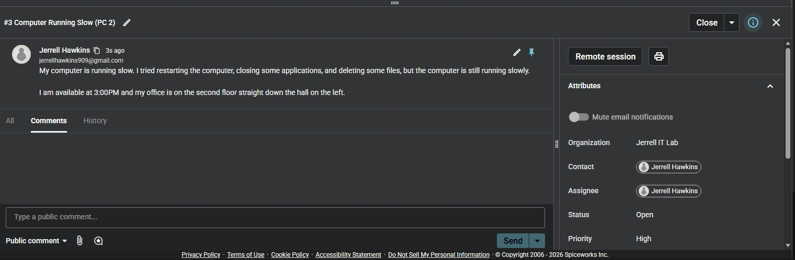
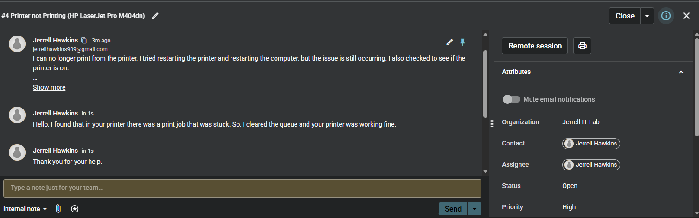
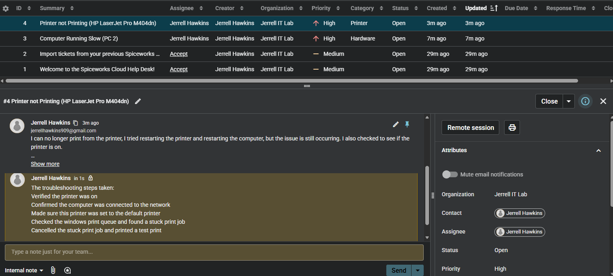
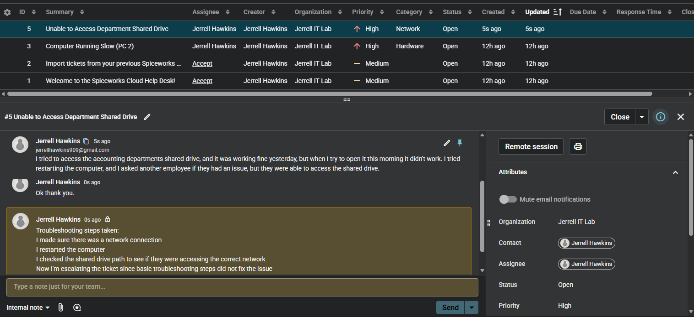

# Spiceworks Help Desk Ticketing Lab

**Author:** Jerrell Hawkins

**Skills:** Ticket intake, incident documentation, user communication, printer troubleshooting, escalation

## Project documentation

[View slide deck as PDF](spiceworks.pdf) | [Download PowerPoint](spiceworks.pptx)

The notes and images below are drawn from the supplied project presentation. Lab accounts, networks, and incidents are practice scenarios.

## Slide 1

IT PORTFOLIO PROJECT

Spiceworks Help Desk
Ticketing Lab

Simulated Service-Desk Workflow

Jerrell Hawkins

Ticket intake | Troubleshooting | User communication | Resolution | Escalation

Lab objective

Practice the complete support lifecycle: capture the problem, document work, communicate clearly, resolve when possible, and escalate with useful evidence.

## Slide 2

PROJECT OVERVIEW

The Lab Simulated the Work Behind a Tier 1 Ticket Queue

02

Environment

Spiceworks Cloud Help Desk configured as Jerrell IT Lab with simulated requester, technician, and assignee roles.

Scenarios

Slow workstation, failed printer output, and loss of access to a department shared drive.

Workflow

Created and categorized tickets, recorded user details, added public updates and internal notes, and documented outcomes.

Support judgment

Resolved a known printer condition and recognized when a shared-drive issue required escalation beyond basic troubleshooting.

## Slide 3

TICKET INTAKE AND TRIAGE

I Captured the Issue and the User's First Actions

03

Ticket #3: Computer Running Slow

The request records the symptom, steps already attempted, user availability, and physical location. The ticket is assigned, categorized as Hardware, and left Open for investigation.

What good intake provides

- A searchable, specific summary.
- The user's symptoms and attempted fixes.
- Contact and scheduling details.
- Ownership, category, status, and priority fields.
- Enough context to begin troubleshooting without repeating questions.

Triage standard

Priority should reflect business impact and urgency. A single slow PC is not automatically high priority.

## Slide 4

CUSTOMER COMMUNICATION AND RESOLUTION

I Documented the Printer Resolution

04

Public update

The response explains the cause in plain language: a stuck print job was cleared from the queue and printing resumed. The requester then acknowledged the help.

Support behaviors shown

- Replied in the ticket instead of using an undocumented side channel.
- Explained the root cause without unnecessary info.
- Recorded the corrective action and restored service.
- Received user acknowledgment before final closure.

Evidence note

The screenshot still displays Status: Open. It proves the resolution was documented, but not that the status was changed to Closed.

## Slide 5

INTERNAL TROUBLESHOOTING DOCUMENTATION

I Separated Technical Notes From the Public Conversation

05

Internal note captured

- Verified the printer was powered on.
- Confirmed the workstation had network connectivity.
- Checked that the correct printer was set as default.
- Inspected the Windows print queue and found a stuck job.
- Canceled the job and completed a test print.

Why internal notes matter

It makes it easier for another technician without exposing unnecessary technical detail to the requester.

Result: A repeatable record of what was checked, what was found, and what fixed the incident.

## Slide 6

ESCALATION AND HANDOFF

I Documented the Limits of Tier 1 Troubleshooting

06

Ticket #5: Department Shared Drive

- Confirmed the workstation had network connectivity.
- Restarted the computer.
- Verified the shared-drive path and target network.
- Compared impact with another employee who could still connect.
- Recorded that basic troubleshooting did not resolve the issue.

Escalation decision

The evidence supports preparing a higher-tier handoff because the issue persisted and appeared isolated to one user's access or permissions.

Evidence boundary: The internal note says the ticket will be escalated, but the screenshot does not show reassignment to another technician or support group.

## Slide 7

WORKFLOW SUMMARY

A Consistent Lifecycle Guided Every Ticket

07

01

Intake

Capture symptoms, impact, requester details, and prior attempts.

02

Triage

Set category, owner, status, and priority from impact and urgency.

03

Work

Troubleshoot methodically and document technical findings internally.

04

Finish

Resolve and confirm with the user, or escalate with a complete handoff.

Core principle

A useful ticket tells the next technician what happened without requiring the user to start over.

## Slide 8

PROFESSIONAL TICKETING STANDARDS

Future Project Improvement's

08

Impact-based priority

Use urgency and business impact instead of assigning every incident High priority.

Clear role separation

Use distinct requester and technician test accounts so the conversation mirrors a real service desk.

Complete closure proof

Capture the final Closed or Resolved status after confirming service with the requester.

Visible escalation handoff

Show the new assignee or support group, reason for escalation, completed checks, and expected next action.

## Slide 9

SKILLS DEVELOPED

What I Learned from the Lab

09

Ticket quality

How a precise summary, structured fields, and complete description improve ownership and response time.

Customer communication

How to acknowledge symptoms, explain a fix plainly, and keep the requester informed through the ticket.

Technical documentation

How internal notes create a reusable troubleshooting history and support a smooth technician handoff.

Escalation judgment

How to recognize the limits of Tier 1 support and escalate only after recording completed checks and results.

## Slide 10

End

Summary

10

Spiceworks Help Desk Ticketing Lab | Simulated Environment

- Created and managed simulated support tickets in Spiceworks Cloud Help Desk for workstation performance, printer, and shared-drive access incidents.
- Documented requester symptoms, prior actions, troubleshooting steps, technical findings, public updates, and internal technician notes throughout the ticket lifecycle.
- Resolved a printer issue by identifying and clearing a stuck print job, then prepared a shared-drive incident for escalation after basic troubleshooting did not restore access.

Skills: Spiceworks Cloud Help Desk, ticket intake, incident documentation, troubleshooting, customer communication, ticket resolution, escalation

